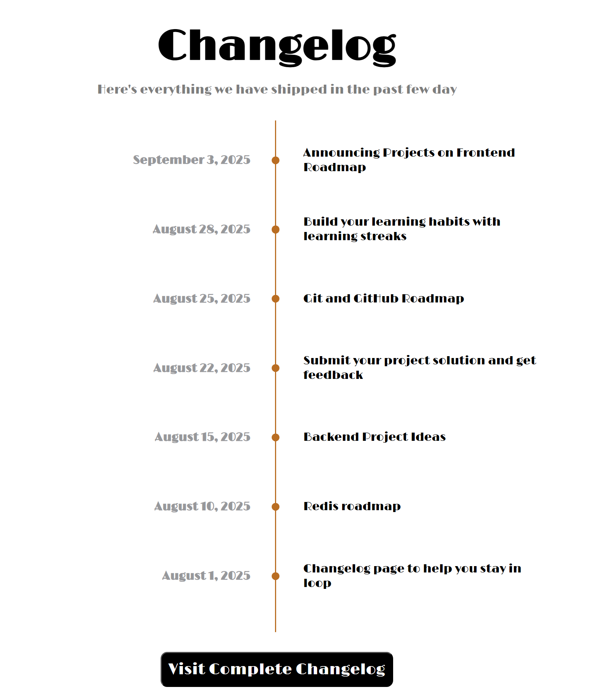

# changelog
For this project, the goal was to create a classic looking changelog and style it.

# Link to Project in Roadmap.sh
https://roadmap.sh/projects/changelog-component

# Learning Objective of This Project
The learning object of this project was to use 
different combinators as well as attributes with 
styling the page. 

# Challenges
The biggest challenge for this project was to style
the changelog in the classic way. I used W3Schools to 
help with understanding the different ways to make
symbols and lines in CSS. In the end I ended up using Claude for help with styling the page.

# Tech-Stack
HTML, CSS

# Screenshot
### Changelog
